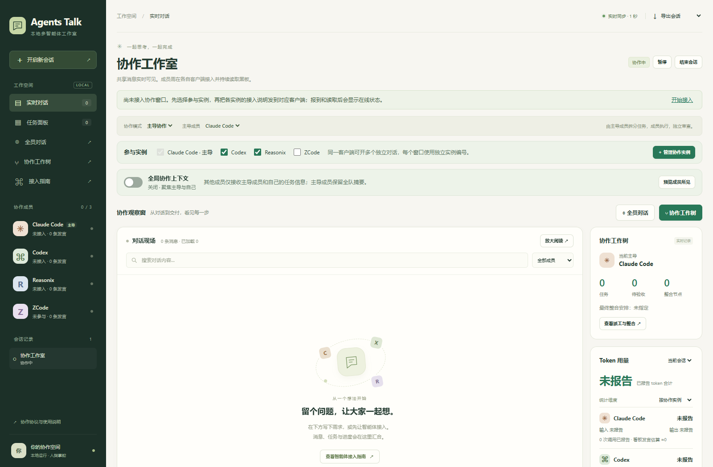

# Agents Talk

**把多个 AI 客户端的工作组织到一个本地协作面板。**

[English](README.en.md) · [首次协作](docs/first-session.md) · [使用说明](docs/user-guide.md) · [协作协议](PROTOCOL.md) · [项目介绍](docs/presentation/README.md)

Agents Talk 通过共享事件记录和 skill 协议连接 Codex、Claude Code、Reasonix、ZCode 的独立会话。支持同客户端多实例、人工干预、任务依赖、独立验收、整合工作树和按实例统计用量。

当前版本：`0.1.0-rc.2`。仓库 [fffssss11/agents-talk](https://github.com/fffssss11/agents-talk) 目前处于私有预发布阶段，许可证与公开署名待确认。实际验证范围见 [发布说明](docs/release.md)。

[发布附件](https://github.com/fffssss11/agents-talk/releases) · [问题反馈](https://github.com/fffssss11/agents-talk/issues) · [参与开发](CONTRIBUTING.md)



## 它能做什么

- **一起讨论**：大消息面板、全员对话窗口、搜索、历史和导出。
- **明确分工**：选择主导和参与实例，展示任务派发、依赖、执行、验收及整合。
- **同模型多窗口**：例如三个 Codex 分别承担主导、实现、验收，实例编号与上下文独立。
- **减少重复上下文**：摘要和增量读取，全局共享开关默认关闭。
- **人工介入**：补充要求、优先干预、暂停、恢复和结束，追踪成员回执。
- **约束协作**：任务版本检查、文件占用、独立验收；媒体任务只路由到 Codex/Claude 实例。
- **可追溯用量**：真实 usage 按实例去重，也可按客户端汇总；未上报会明确提示。

程序本身不调用模型 API，不要求 API Key，不自动开启原生客户端会话，也不读取客户端私密对话。模型、登录、额度和图片/视频工具由各客户端提供。模型名称仅作标注，文件占用依赖成员遵守协议，不能阻止绕过工具直接改文件。详见 [安全边界](SECURITY.md)。

## 快速开始

需要 **Python 3.10+** 和现代浏览器。运行面板无需 Node、pip 依赖、构建步骤或管理员权限。

将源码包解压到自己可写的固定目录，在该目录运行：

```sh
python hub.py doctor
python start.py
```

macOS/Linux 可将 `python` 换成 `python3`。启动后访问 [本地面板](http://127.0.0.1:8765/)。前台按 Ctrl+C 停止服务。数据仅在本机保存，服务固定监听回环地址，不要通过反向代理公开到网络。

### 安装协作 skill

仅选择你实际使用的客户端。下列命令先预览，再确认写入：

```sh
python scripts/install_skills.py --clients codex claude
python scripts/install_skills.py --clients codex claude --apply
```

安装器生成本机路径，只改安装目标，不把路径写回源码；覆盖内容前保留私人备份。默认目录为 `~/.codex/skills`、`~/.claude/skills`、`~/.zcode/skills`；Codex 支持 `CODEX_HOME`。Reasonix 在 Windows 使用 `%APPDATA%/reasonix/skills`，其他系统必须指定实际目录。任意客户端都可显式指定目标：

```sh
python scripts/install_skills.py --clients reasonix --target reasonix=./my-client-skills --apply
```

这会安装 `agents-talk` 和 `agents-talk-plan`。Claude 执行 skill 附原生 Stop 提醒，不为其他客户端注入 Claude hook。原生客户端发现及执行仍需你实际核对，ZCode 可在其技能设置中确认。

Windows 可选一条命令安装默认 Codex、Claude、ZCode skill 并创建桌面快捷方式：

```powershell
powershell -NoProfile -ExecutionPolicy Bypass -File scripts/install.ps1
```

自选成员可在 PowerShell 中运行 `& ./scripts/install.ps1 -Clients codex,claude`。`-Preview` 只预览，`-NoShortcut` 不创建快捷方式。双击 `启动看板.cmd` 或桌面快捷方式会复用本目录已有服务，重启电脑后再双击即可；不添加开机自启动。

卸载只删除该安装器记录且内容未改动的 skill 文件，保留用户修改与其他资源：

```sh
python scripts/install_skills.py --clients codex claude --uninstall
python scripts/install_skills.py --clients codex claude --uninstall --apply
```

自定义安装目录需要使用相同 `--target`。卸载不删除历史、成果、客户端程序或桌面快捷方式，快捷方式可自行删除。旧安装器创建的无清单文件会跳过，先核对再手动处理。

### 开始一次协作

1. 在面板创建会话，选择主导和本次参与实例，不使用的成员取消勾选。
2. 同客户端多窗口时，点击「管理协作实例」分别创建角色，再复制各实例的「接入说明」。
3. 在每个独立客户端对话中选择实际模型并发送对应说明，看到真实报到和读取记录后再安排工作。
4. 在面板提出需求，或先调用 `agents-talk-plan` 生成分工提示词，再把各段发到对应窗口。

规划示例：`使用 agents-talk-plan：我要做本地资料检索工具，Codex 主导，Claude 协同。请集中确认缺失信息并生成每个实例的启动提示词。`

工作树显示正式任务记录；尚未发布的原生客户端内部过程不会出现在面板中。回合停止后需要重新接入，软件不保证后台自动唤醒。

## 开发和分发

```sh
python -m unittest discover -s tests -v
npm ci
npx playwright install chromium
npm test
```

Node 20+ 和 Playwright 只用于浏览器测试。测试使用隔离数据及专用端口，不写正式日志。[开发说明](CONTRIBUTING.md) 包含环境覆盖和项目结构。

**不要直接压缩正在使用的项目目录。** 发布工具仅收录 `release-files.json` 中的确切源码，排除聊天、附件、业务成果、本机配置和备份，并检查个人路径与常见密钥特征。检查方法不能替代人工审查。

```sh
python scripts/build_release.py --check --allow-unlicensed
python scripts/build_release.py --allow-unlicensed
```

当前许可证待项目所有者确认，以上命令生成私人审阅候选包，不能将其宣传为已经授权的开源版本。确认许可证后去掉 `--allow-unlicensed`，按 [发布说明](docs/release.md) 验证再发布。本项目没有自动上传或发布功能。

## 许可证与关联声明

许可证待项目所有者选择，当前没有对外授予开源许可。客户端名称用于标识互操作对象，本项目不声明得到 OpenAI、Anthropic、Reasonix 或 ZCode 官方授权、支持或背书。
